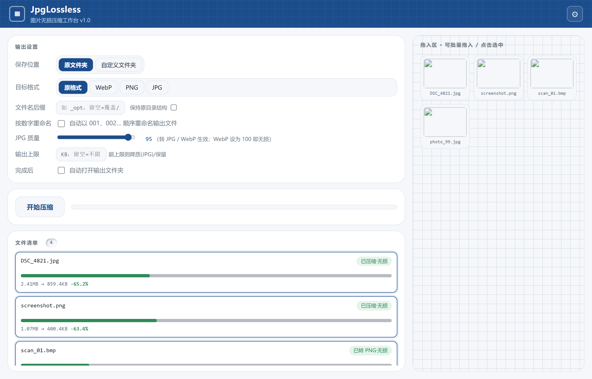

# JpgLossless · 图片压缩工作台（Web 版）

<p align="center">
  
</p>

纯本地运行的图片压缩工具。界面用系统 Edge **WebView2** 内核渲染（「工程蓝图」风格），
压缩逻辑全部在本机完成，图片**不会上传**任何服务器。

## 快速使用

1. 双击 `JpgLossless.exe`（无需安装 Python）。
2. 把图片 / 文件夹拖进右侧「拖入区」，或点「选择文件 / 选择文件夹」。
3. 在左侧设置：保存位置、目标格式、文件名后缀、JPG 质量、是否自动打开输出文件夹。
4. 选中某个文件后点「预览选中对比」，可先在右侧查看前后大小与效果。
5. 点「开始压缩」。

每个文件行里有一条**像素对比条**：灰色=原大小，蓝/绿=压缩后大小（变绿表示更小，变橙表示变大），
配合等宽字体的字节数与百分比，压缩结果一眼可见。

## 功能

- 原格式无损（JPG/PNG，依赖 `ect` 引擎；首次使用自动下载，无网络时把 `ect.exe` 放进 `bin/`）
- 转 WebP 无损 / PNG / JPG（JPG 有损，质量可调）
- 批量拖入、文件夹递归、保持目录结构
- 输出前预览对比、处理完成自动打开输出文件夹
- 设置自动写入 `config.json`，下次启动恢复

## 运行环境

- Windows 10 / 11（需 Edge WebView2 运行时，系统通常自带；若双击报错提示缺少 WebView2，
  到微软官网安装「WebView2 Runtime」即可）
- 压缩引擎 `bin/ect.exe` 已随包内置；原文件夹无损模式若缺失会自动联网下载

## 开发 / 打包

```bash
# 源码运行（需 Python + pip install pywebview pillow）
python jpg_lossless_web.py

# 打包为单文件 exe
pyinstaller --onefile --noconsole --name JpgLossless ^
  --add-binary "bin/ect.exe;bin" --add-data "web/index.html;web" ^
  --hidden-import webview --collect-submodules webview --collect-data webview ^
  jpg_lossless_web.py
```

## 文件结构

```
jpg-lossless/
├── JpgLossless.exe        ← 双击即用（方案 B 成品，WebView2 界面）
├── jpg_lossless_web.py    ← 后端（pywebview API + 压缩逻辑）
├── jpg_lossless_gui.py    ← 旧版 tkinter 界面（保留参考）
├── web/index.html         ← 前端界面
├── bin/ect.exe            ← 压缩引擎
├── config.json            ← 自动生成（上次设置）
└── README.md
```
